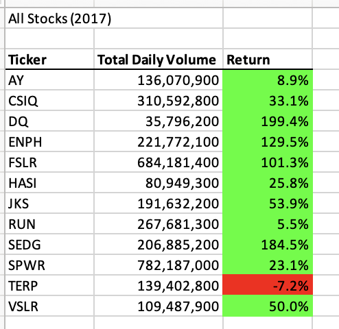
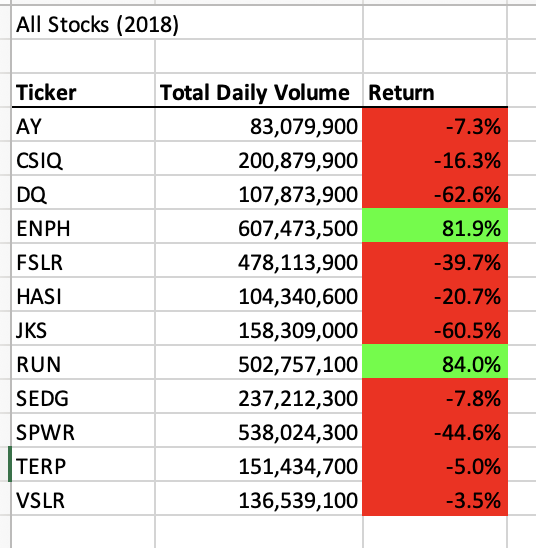
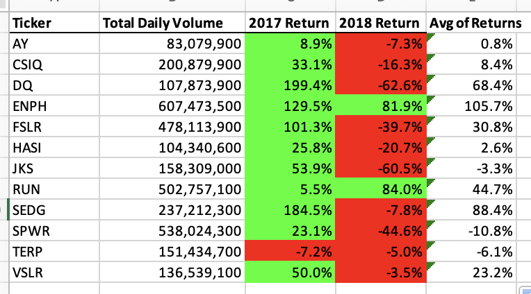
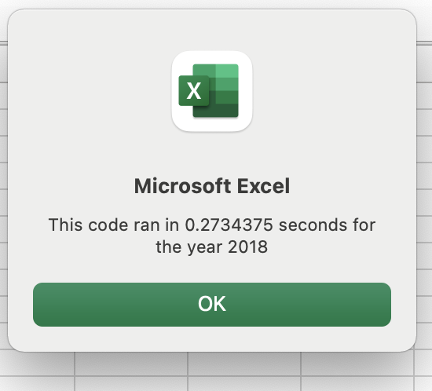
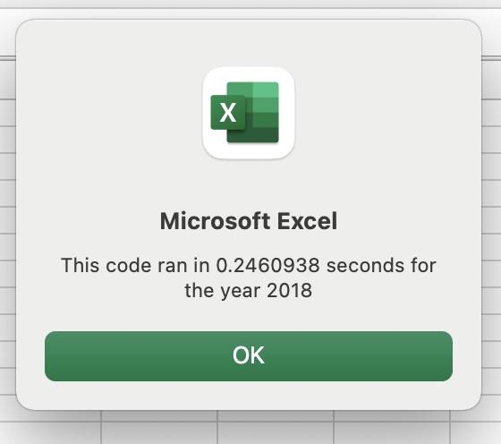

# Model 2 Challenge - Stock Analysis 

## Overview 
        The purpose of this activity is to create a VBA script to help better analyse green investments. A dataset of daily open/close prices for several potential investments are broken down into yearly returns in order to get a better picture on the preformace of the stocks. The better preforming stocks will then be considered for an investment. The script will be refactored for faster preformance and efficiency. 

## Results 
        The VBA script we created looped throught the data to pull total daily volume for each stock along with the starting and ending prices. The script then used formatting to create a consise table that summerized the yearly performace of each stock. 

        The table above shows the 2017 return of a series of green stocks. All but one of the stocks ended up higher. DQ, SEDG, and ENPH were the highest preformers over doubling in price for the year. 

        The table above shows stock preformance for 2018. Stock prices were down for the most part, and preformance was worse across the board with the exception of RUN. 

        
        The table above shows return for both 2017 and 2018. As a whole the stocks did much better in 2017. The two stocks that were positive in both years were ENPH and RUN. RUN also had the highest average return, followed by SEDG. From the analysis, we can conclude that RUN had the best performance and would be the stock to invest in. The analysis is limited to the past two years returns, and growth projections and other valuations should be considered before purchasing, as past preformance is not a guarentee of future gains. 

### UNFACTORED CODE 

### REFACTORED CODE 

        The above images show result of refactoring code. The refactored code saved 0.04 seconds of processing time. 

## Summary 
         Refactoring code has many advantages. Often times when code is first written the main goal is for it to complete the task intended. The code can be unorganized, hard to read, and inefficient. Going back and organizing the code makes it more readable and easier to follow. Adding notes helps others understand what's going on. Consolidating steps, like performing one loop instead of two saves time and money. Making code that is hard to read can cause problems later on when it needs to be updated or understood by you or someone else. If code cannot be read then its hard to adjust and work with, and could end up breaking a whole process or impending business activity.  In large scale projects where there is a lot of code and processes, milliseconds count. An example of this would be a search engine. Google goes through mountains of data every minute and saving a few milliseconds here and there really add up. Also their code is constantly updated to add additional functioniality. If they are relying on code that is hard to read, it would not only be hard to improve upon, it could cause the system to crash beucase the code could be misunderstood. Disadvantages to factoring code would be in a circumstance like this exercise. I saved 0.04 seconds by refactoring my code. This project is quite small and the VBA will probably only ever be run a handful of times, so going back and spending the time refactoring might be all for not. Refactoring code where it would be less time consuming to throw it out and start from scratch would be an example of another disadvantage.
         
         The refactored VBA script has many advantages. It is much easier to read since the variables clearly identify what they represent in the code. Instead of using the integer i as a variable, we now use tickerindex and tickerendingprices instead of endingprices give a more clear idea. By moving the table output into its own loop, we were able to speed up the exectuion time. The refactored script has the advantage of time and efficiency. It ran 8% quicker than the original code. If the dataset were larger, the refactored code could have a large advantage, but for our purposes it did not save much time. The code is also easier to read. Creating a seperate loop to produce the results better organized the code which made it easier to read. It also reduced the runtime. I would have an easier time coming back to the reformatted coode and being able to make sense on its purpose and fucnctionality.