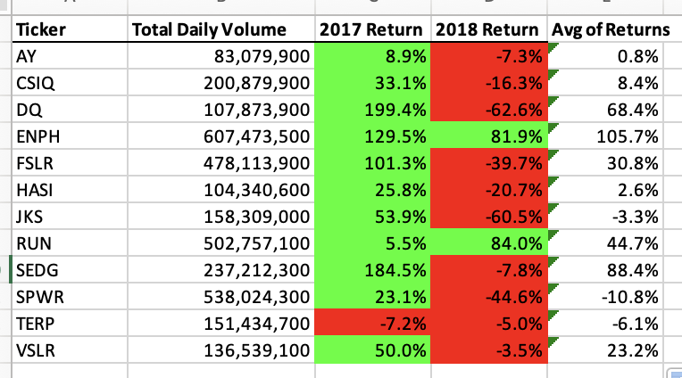
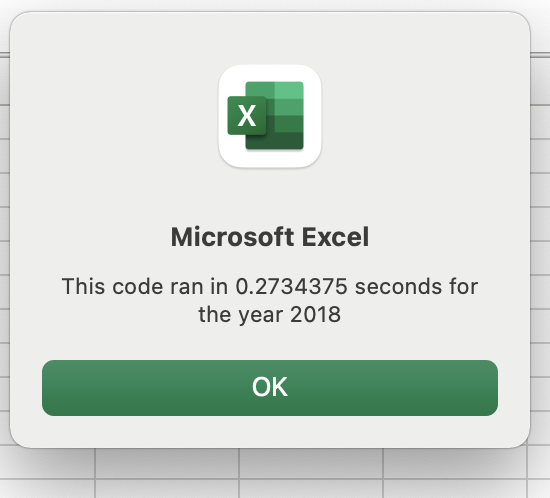

# Model 2 Challenge - Stock Analysis 

## Overview 

### The purpose of this activity is to create a VBA script to help better analyse investments. A dataset of daily open/close prices for several potential investments are broken down into yearly returns in order to get a better picture on the preformace of the stocks. The better preforming stocks will then be selected as an investment. The script will be refactored for faster preformance and efficiency. 

## Results 

### The table above shows the 2017 return of a series of green stocks. All but one of the stocks ended up higher. DQ, SEDG, and ENPH were the highest preformers over doubling in price for the year. 

### The table above shows stock preformance for 2018. Stock prices were down for the most part, and preformance was worse across the board with the exception of RUN. 

The table above shows return for both 2017 and 2018. As a whole the stocks did much better in 2017. The two stocks that were positive in both years were ENPH and RUN. RUN also had the highest average return, followed by SEDG. From the analysis, we can conclude that RUN had the best performance and would be the stock to invest in. The analysis is limited to the past two years returns, and growth projections should also be considered before investing as RUN could now be overpriced. 

### UNFACTORED CODE 

### REFACTORED CODE 

### The above images show result of refactoring code. The refactored code saved 0.04 seconds of processing time. 